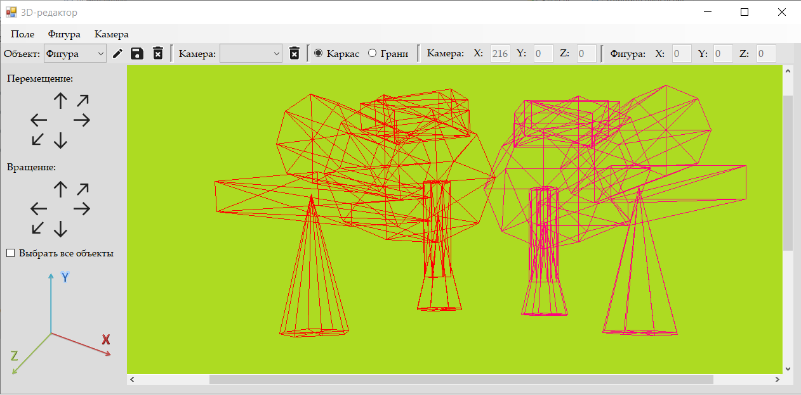
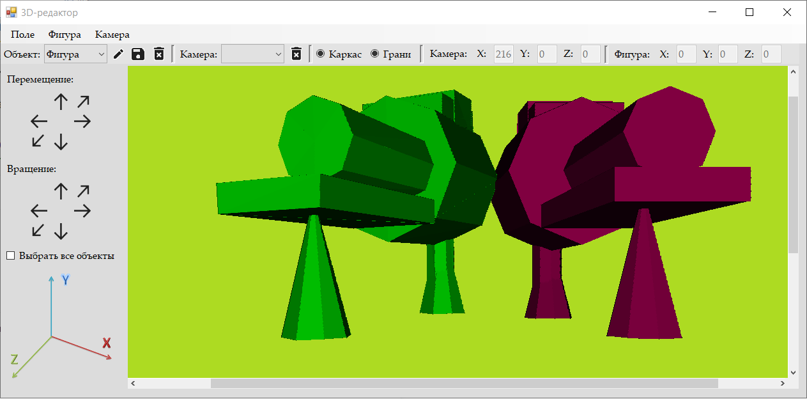
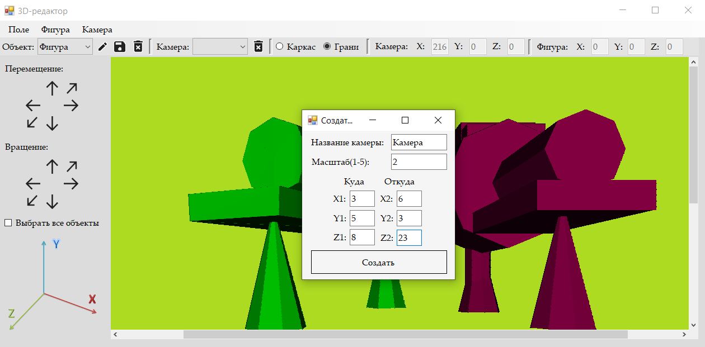

# 3D-Editor
Графический 3D-редактор с фиксированной моделью
##### Начало работы - создание поля
​
##### Создание модели с заданными параметрами
​
##### Проволочный каркас
​
##### Вид с гранями
​
##### Создание новой камеры
​
